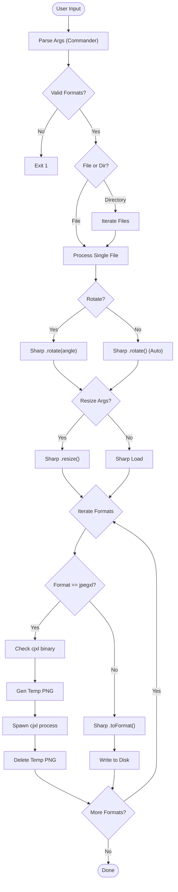

# Image Processor CLI - Technical Explainer

This document details the architecture, implementation patterns, and testing strategy for the Image Processor CLI. It is intended for developers looking to understand the internal mechanics or contribute to the project.

## 🛠 Technology Stack & Rationale

* **[TypeScript](https://www.typescriptlang.org/)**: Enforces type safety, particularly useful for handling the various configuration options and external library interfaces.
* **[Commander.js](https://github.com/tj/commander.js)**: Chosen for its robust argument parsing and automatic help generation, simplifying the CLI interface implementation.
* **[Sharp](https://sharp.pixelplumbing.com/)**: The core engine for image manipulation. Selected for its high performance (using libvips) and low memory footprint compared to other Node.js image libraries.
* **[libjxl (cjxl)](https://github.com/libjxl/libjxl)**: Integrated as an external binary via `child_process`. This hybrid approach allows the tool to support the modern JPEG XL format before native Node.js bindings are fully mature or available in Sharp.
* **[Playwright](https://playwright.dev/)**: While primarily a browser testing tool, its test runner (`@playwright/test`) provides a powerful assertion library and parallel execution capabilities that are excellent for integration testing CLI tools.

## 🏗 Architecture & Implementation Patterns

The application logic is centralized in `src/index.ts` to maintain simplicity, but follows distinct patterns for different tasks.

### 1. Hybrid Conversion Pipeline

The tool implements a strategy pattern to handle different formats:

* **Native Processing**: Formats like JPG, PNG, WebP, and AVIF are handled directly in-process using `sharp`. This is fast and efficient.
* **External Process Delegation**: JPEG XL (`.jxl`) conversion requires a different approach. The tool:
    1. Converts the source image to a temporary intermediate PNG using `sharp`.
    2. Spawns a child process to run the `cjxl` binary, converting the PNG to JXL.
    3. Cleans up the intermediate file.

This pattern allows the CLI to extend support to tools that don't have Node.js bindings yet.

### 2. Sequential Batch Processing

When processing directories, the tool uses sequential `await` loops rather than `Promise.all`.

* **Reasoning**: Image processing is CPU and memory intensive. Running conversions in parallel (e.g., `Promise.all`) could easily exhaust system resources or hit `ulimit` restrictions on file descriptors when processing large directories.
* **Implementation**:

    ```typescript
    for (const file of imageFiles) {
      await convertImage(path.join(dirPath, file), formats, options)
    }
    ```

### 3. Interactive CLI UX

The tool uses `readline` to handle interactive prompts (e.g., overwrite confirmation). This requires careful management of the `process.stdin` stream to ensure it doesn't interfere with the command execution flow.

## 💻 Usage Reference

### Syntax

```bash
npx tsx src/index.ts <source> [options]
```

### Key Options

| Option | Description | Implementation Note |
| :--- | :--- | :--- |
| `--formats <list>` | Output formats (e.g., `webp avif`). | Validated against a whitelist. `all` expands to all supported formats. |
| `--width <px>` | Resize width. | If height is omitted, aspect ratio is preserved. |
| `--height <px>` | Resize height. | If width is omitted, aspect ratio is preserved. |
| `--no-enlargement` | Prevent upscaling. | Passed to Sharp's `resize` options. |
| `--rotate <deg>` | Rotate image. | Auto-orients based on EXIF if omitted. |
| `--grayscale` | Grayscale conversion. | Reduces image to single channel (or b-w). |
| `--to-srgb` | Color space conversion. | Ensures web compatibility. |
| `--verbose` | Detailed logging. | Toggles `stdio` inheritance for child processes (`cjxl`). |

## 🧪 Integration Testing Strategy

The project uses **Playwright** for end-to-end integration tests. Instead of mocking the file system or the `sharp` library, tests execute the actual CLI binary against real fixture files.

### Test Harness (`tests/image_converter_cli.spec.ts`)

The test suite manages the lifecycle of a test run:

1. **Setup**: A dedicated `converted-test` directory is cleaned/created before each test.
2. **Execution**:
    * `execSync`: Used for standard "fire and forget" commands.
    * `spawn`: Used for testing interactive features (like piping `y` or `n` to the overwrite prompt).
3. **Verification**:
    * **Existence**: Checks if output files are created.
    * **Content**: Uses `sharp` to read metadata (dimensions) of generated files to verify resizing logic.

### Example: Verifying Resize Logic

This test ensures that the CLI correctly passes parameters to the underlying Sharp instance and that aspect ratio calculations are correct.

```typescript
test('resizes image with given width and maintains aspect ratio', async () => {
  const width = 150
  // Execute CLI
  execSync(`npx tsx ${CLI_PATH} ${IMAGE_PATH} --formats png --out ${OUTPUT_DIR} --width ${width}`, {
    encoding: 'utf-8',
  })

  // Verify output using Sharp metadata
  const outputFile = path.join(OUTPUT_DIR, 'test.png')
  const metadata = await sharp(outputFile).metadata()

  expect(metadata.width).toBe(width)
  // Aspect ratio check would go here
})
```

## 📊 Logic Flow Diagram


