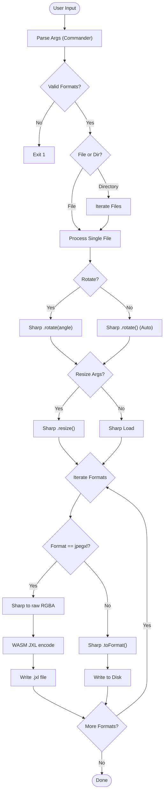

# Image Processor CLI - Technical Explainer

This document details the architecture, implementation patterns, and testing strategy for the Image Processor CLI. It is intended for developers looking to understand the internal mechanics or contribute to the project.

## 🛠 Technology Stack & Rationale

* **[TypeScript](https://www.typescriptlang.org/)**: Enforces type safety, particularly useful for handling the various configuration options and external library interfaces.
* **[Commander.js](https://github.com/tj/commander.js)**: Chosen for its robust argument parsing and automatic help generation, simplifying the CLI interface implementation.
* **[Sharp](https://sharp.pixelplumbing.com/)**: The core engine for image manipulation. Selected for its high performance (using libvips) and low memory footprint compared to other Node.js image libraries.
* **[@jsquash/jxl](https://www.npmjs.com/package/@jsquash/jxl)**: Integrated as a WebAssembly encoder for JPEG XL output. This keeps the tool Node-centric and avoids external system-level dependencies.
* **[Playwright](https://playwright.dev/)**: While primarily a browser testing tool, its test runner (`@playwright/test`) provides a powerful assertion library and parallel execution capabilities that are excellent for integration testing CLI tools.

## 🏗 Architecture & Implementation Patterns

The application logic is centralized in `src/index.ts` to maintain simplicity, but follows distinct patterns for different tasks.

### 1. Hybrid Conversion Pipeline

The tool implements a strategy pattern to handle different formats:

* **Native Processing**: Formats like JPG, PNG, WebP, and AVIF are handled directly in-process using `sharp`. This is fast and efficient.
* **WASM JPEG XL Encoding**: JPEG XL (`.jxl`) conversion is handled by `@jsquash/jxl`. The tool:
  1. Uses `sharp` to apply transformations and produce raw RGBA pixel data.
  2. Encodes those pixels to JXL in-process via WebAssembly.
  3. Writes the resulting `.jxl` bytes to disk.

This pattern allows JPEG XL support without requiring external binaries.

### 2. Sequential Batch Processing

When processing directories, the tool uses sequential `await` loops rather than `Promise.all`.

* **Reasoning**: Image processing is CPU and memory intensive. Running conversions in parallel (e.g., `Promise.all`) could easily exhaust system resources or hit `ulimit` restrictions on file descriptors when processing large directories.
* **Implementation**:

    ```typescript
    for (const file of imageFiles) {
      await convertImage(path.join(dirPath, file), formats, options)
    }
    ```

### 3. Interactive CLI UX

The tool uses `readline` to handle interactive prompts (e.g., overwrite confirmation). This requires careful management of the `process.stdin` stream to ensure it doesn't interfere with the command execution flow.

When output would overwrite the input file path (for example, converting an `.avif` source to `.avif` in-place), the CLI auto-generates a numbered filename (e.g., `image-1.avif`) instead of prompting for overwrite.

## 💻 Usage Reference

### Syntax

```bash
npx tsx src/index.ts <source> [options]
```

If `--formats` is omitted, the CLI defaults to all supported output formats.

### Key Options

| Option | Description | Implementation Note |
| :--- | :--- | :--- |
| `--formats <list>` | Output formats (e.g., `webp avif`). | Validated against a whitelist. Omitted or `all` expands to all supported output formats. |
| `--jpg-quality <1-100>` | JPEG output quality. | Default is 80. Override via CLI flag; passed to Sharp as `quality` for JPG output. |
| `--png-quality <1-100>` | PNG output quality. | Default is 100. Override via CLI flag; passed to Sharp as `quality` for PNG output. |
| `--webp-quality <1-100>` | WebP output quality. | Default is 80. Override via CLI flag; passed to Sharp as `quality` for WebP output. |
| `--avif-quality <1-100>` | AVIF output quality. | Default is 50. Override via CLI flag; passed to Sharp as `quality` for AVIF output. |
| `--jpegxl-quality <1-100>` | JPEG XL output quality. | Default is 85. Override via CLI flag; passed to the WASM JXL encoder. |
| `--width <px>` | Resize width. | If height is omitted, aspect ratio is preserved. |
| `--height <px>` | Resize height. | If width is omitted, aspect ratio is preserved. |
| `--no-enlargement` | Prevent upscaling. | Passed to Sharp's `resize` options. |
| `--rotate <deg>` | Rotate image. | Auto-orients based on EXIF if omitted. |
| `--grayscale` | Grayscale conversion. | Reduces image to single channel (or b-w). |
| `--to-srgb` | Color space conversion. | Ensures web compatibility. |
| `--verbose` | Detailed logging. | Enables additional conversion/encoder logs and prints full error stacks/details on failures. |

Directory input scanning accepts: `.jpg`, `.jpeg`, `.png`, `.webp`, `.avif`, `.tif`, `.tiff`.

## 🧪 Integration Testing Strategy

The project uses **Playwright** for end-to-end integration tests. Instead of mocking the file system or the `sharp` library, tests execute the actual CLI binary against real fixture files.

### Test Harness (`tests/image_converter_cli.spec.ts`)

The test suite manages the lifecycle of a test run:

1. **Setup**: A dedicated `converted-test` directory is cleaned/created before each test.
2. **Execution**:
    * `execSync`: Used for standard "fire and forget" commands.
    * `spawn`: Used for testing interactive features (like piping `y` or `n` to the overwrite prompt).
3. **Verification**:
    * **Existence**: Checks if output files are created.
    * **Content**: Uses `sharp` to read metadata (dimensions) of generated files to verify resizing logic.

### Example: Verifying Resize Logic

This test ensures that the CLI correctly passes parameters to the underlying Sharp instance and that aspect ratio calculations are correct.

```typescript
test('resizes image with given width and maintains aspect ratio', async () => {
  const width = 150
  // Execute CLI
  execSync(`npx tsx ${CLI_PATH} ${IMAGE_PATH} --formats png --out ${OUTPUT_DIR} --width ${width}`, {
    encoding: 'utf-8',
  })

  // Verify output using Sharp metadata
  const outputFile = path.join(OUTPUT_DIR, 'test.png')
  const metadata = await sharp(outputFile).metadata()

  expect(metadata.width).toBe(width)
  // Aspect ratio check would go here
})
```

## 📊 Logic Flow Diagram


```mermaid
graph TD
    Start([User Input]) --> Parse["Parse Args (Commander)"]
    Parse --> Validate{Valid Formats?}
    Validate -- No --> Error[Exit 1]
    Validate -- Yes --> Detect{File or Dir?}

    Detect -- Directory --> Loop[Iterate Files]
    Detect -- File --> Process[Process Single File]
    Loop --> Process

    Process --> Rotate{Rotate?}
    Rotate -- Yes --> SharpRotate["Sharp .rotate(angle)"]
    Rotate -- No --> SharpAutoOrient["Sharp .rotate() (Auto)"]

    SharpRotate --> Resize{Resize Args?}
    SharpAutoOrient --> Resize

    Resize -- Yes --> SharpResize["Sharp .resize()"]
    Resize -- No --> SharpLoad[Sharp Load]

    SharpResize --> FormatLoop{Iterate Formats}
    SharpLoad --> FormatLoop

    FormatLoop --> IsJXL{Format == jpegxl?}

    %% JXL Path
    IsJXL -- Yes --> SharpRaw[Sharp to raw RGBA]
    SharpRaw --> WasmEncode[WASM JXL encode]
    WasmEncode --> WriteJXL[Write .jxl file]
    WriteJXL --> Next

    %% Standard Path
    IsJXL -- No --> SharpConvert["Sharp .toFormat()"]
    SharpConvert --> Write[Write to Disk]
    Write --> Next

    Next{More Formats?} -- Yes --> FormatLoop
    Next -- No --> Finish([Done])
```
